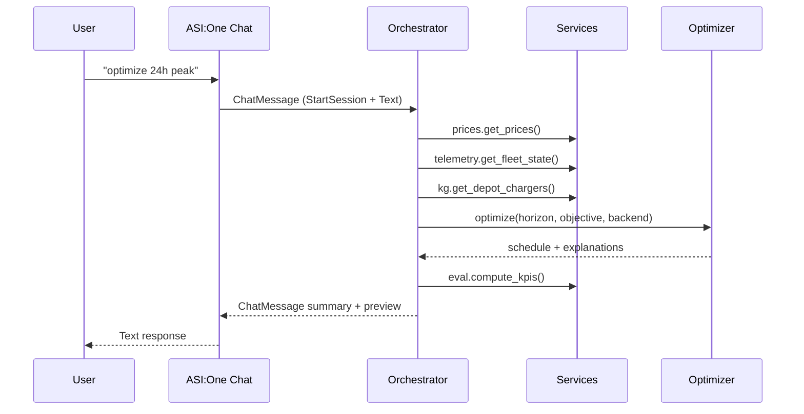

# EV Fleet Charge Optimizer — Orchestrator Agent


## Role & Problem
- Fleet depots risk peak charges and missed departures when scheduling is manual.
- The orchestrator acts as an autonomous dispatcher: it interprets chat commands (ASI:One), weighs grid limits, applies what-if overrides, and emits explainable charging plans.

## Capabilities
- **ASI:One Chat Protocol** — `chat_protocol_spec` manifest published for Agentverse discovery.
- **Conversational intents** — `optimize`, `preview`, `explain vX`, `compare cost vs peak`, `status`, runtime defaults, what-if updates.
- **Optimization** — Greedy heuristic for instant answers plus OR-Tools MILP for per-charger optimality (connector-aware, blackout-aware).
- **Knowledge Graph** — CSV-backed depot + charger data with optional Hyperon/MeTTa facts when `USE_METTA=true`.
- **REST surface** — `/optimize`, `/compare`, `/status`, `/whatif/site_peak`, `/whatif/blackout` for programmatic frontends.

## Request/Response Flow


## Environment Variables
| Variable | Description |
|----------|-------------|
| `ASI_ONE_API_KEY` | Mailbox + ASI:One authentication |
| `ORCHESTRATOR_AGENT_NAME` | Agentverse display name |
| `ORCHESTRATOR_SEED_PHRASE` | Deterministic wallet seed |
| `USE_MAILBOX` | Enable Agentverse mailbox (true/false) |
| `HORIZON_HOURS` | Default planning horizon |
| `OBJECTIVE_DEFAULT` | `cost` or `peak` |
| `BACKEND` | `greedy` or `milp` |
| `USE_METTA` | Toggle Hyperon/MeTTa integration |
| `PRIVATE_MODE` | Suppress detailed logs |
| `PUBLIC_ENDPOINT` | Optional HTTP endpoint (if exposed) |

## Running Locally
```bash
# install deps
python -m venv .venv
. .venv/bin/activate
pip install -r requirements.txt

# configure
cp .env.example .env
# edit .env (API key, defaults)

# run
set -a && source .env && set +a
python agents/orchestrator_agent.py
```

### systemd (always-on)
See root README for full unit file. Summary:
```bash
mkdir -p ~/.config/systemd/user
$EDITOR ~/.config/systemd/user/ev-optimizer.service
systemctl --user daemon-reload
systemctl --user enable --now ev-optimizer.service
journalctl --user -u ev-optimizer.service -f
```
Optionally `loginctl enable-linger "$USER"` to keep alive after logout.

## Agentverse Checklist
1. Start agent locally with `USE_MAILBOX=true` (mailbox pending).
2. In Agentverse, register Hosted Agent, paste README snippet, set avatar/handle.
3. Supply manifest URL (auto when `publish_manifest=True`).
4. Verify via ASI:One Chat → "connect me to EV Fleet Optimizer".

## Command Cheat Sheet
- `help`, `hi` — show command list.
- `status` — current defaults, backend, MeTTa info.
- `optimize 24h cost|peak` — compute schedule.
- `preview 10 vehicles 24h` — render compact table of last run.
- `explain v5` — per-vehicle detail.
- `compare cost vs peak 48h` — KPI comparison.
- `set default horizon 24h` / `set default objective peak`.
- `set backend milp` — switch solver.
- `set site peak D1 40kW` — override site cap.
- `blackout D2 18-22h` — add blackout window.
- `clear blackouts [D1]`, `clear peak [D1]` — reset overrides.

## REST Endpoints (for frontends/API callers)
| Method | Path | Payload |
|--------|------|---------|
| `GET` | `/status` | — |
| `POST` | `/optimize` | `{ "horizon": 24, "objective": "peak", "backend": "milp" }` |
| `POST` | `/compare` | `{ "horizon": 24 }` |
| `POST` | `/whatif/site_peak` | `{ "depot": "D1", "kw": 40 }` |
| `POST` | `/whatif/blackout` | `{ "depot": "D2", "start": 18, "end": 22 }` |

## Current Limitations & Next Up
- Publish richer MeTTa facts and route queries into schedule explanations.
- Add regression tests for optimizer + REST responses.
- Integrate real telemetry/price feeds (OCPP, ISO day-ahead).
- Align Hosted Agent deployment with Agentverse SEO (handle, avatar, keywords).

## Repository Context
- Core agent entrypoint: [`agents/orchestrator_agent.py`](./orchestrator_agent.py)
- Services: [`services/`](../services)
- Knowledge graph seeds: [`kg/`](../kg)
- Data samples: [`data/`](../data)
- Frontend lives at [`frontend/`](../frontend) (see project root README for full-stack instructions).
